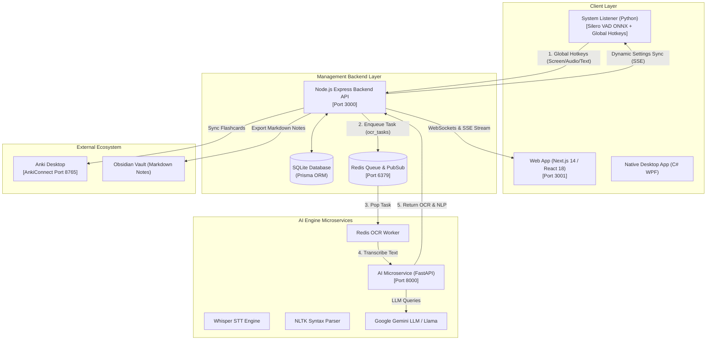

# LingoAnki 📚 (English Learner)


**LingoAnki** là một hệ thống **Trợ lý Học tập & Nghiên cứu Tiếng Anh Toàn diện (AI Learning & Research Assistant)**. Dự án được thiết kế dựa trên triết lý: **Kỹ năng Tiếng Anh là hệ quả tự nhiên (by-product) của quá trình nghiên cứu tài liệu học thuật, đọc sách, đọc paper và tra cứu kiến thức chuyên ngành.**

Hệ thống kết hợp mô hình Monorepo đa dịch vụ (Node.js Backend, Python AI Microservice, System Listener và Next.js Frontend) mang lại trải nghiệm tra cứu, phân tích ngữ pháp, luyện phát âm và ôn tập thẻ lặp lại ngắt quãng (Spaced Repetition) mượt mà mà không làm gián đoạn luồng làm việc (workflow) của người dùng.

---

## 🎯 Tính Năng Nổi Bật (Key Features)

### ⚡ 1. Nhập Liệu Đa Phương Tiện Không Ma Sát (Frictionless Input)
* **Chụp ảnh màn hình OCR nhanh (`Win + Shift + S`):** Chụp vùng bài đọc trên máy tính, hệ thống tự động đẩy dữ liệu qua Redis Queue chạy OCR trích xuất chữ và gửi kết quả về AI Copilot.
* **Ghi âm giọng nói thông minh VAD (`Ctrl + Shift + A`):** Thu âm phát âm hoặc luyện Shadowing từ loa/micro. Tích hợp mô hình **Silero VAD (Voice Activity Detection)** tự động nhận diện khoảng lặng để dừng ghi âm tự nhiên và chạy Whisper STT.
* **Tra cứu nhanh văn bản (`Ctrl + Q`):** Bôi đen đoạn văn bản tiếng Anh bất kỳ trên hệ thống và gửi thẳng về Backend để tra cứu hoặc phân tích ngữ pháp.

### 📚 2. Quản Lý Tài Liệu & Nghiên Cứu Học Thuật (Academic Second Brain)
* **Cấu trúc cây thư mục môn học (`Subject` Hierarchy):** Tổ chức sách, bài giảng, paper theo cấu trúc cây cha-con linh hoạt.
* **Theo dõi tiến độ đọc (`Document Reading Progress`):** Đánh dấu vị trí trang sách (`readingProgress`), trạng thái `UNREAD/READING/COMPLETED`.
* **Trích xuất Highlight & Diễn giải AI (`Highlight`):** Bôi đen các đoạn văn học thuật phức tạp để AI tóm tắt (`aiSummary`) hoặc diễn giải lại (`aiParaphrase`).
* **Phân tích Cấu trúc Ngữ pháp (`NLTK Grammar Parser`):** Bẻ gãy các câu dài học thuật thành các thành phần ngữ pháp cơ bản (Subject, Verb, Object, Clauses) giúp tiếp thu nhanh văn phong chuẩn.

### 🎴 3. Ôn Tập Thông Minh & Kết Nối Hệ Sinh Thái (Anki & Obsidian Sync)
* **Thuật toán SM-2 Nội bộ (`Flashcard`):** Theo dõi thẻ ghi nhớ dựa trên các thông số `interval`, `repetition`, `easeFactor` và `nextReviewDate`.
* **Tích hợp AnkiConnect API:** Đồng bộ 1-click hoặc tự động thẻ từ vựng sang phần mềm **Anki Desktop** (`http://127.0.0.1:8765`), hỗ trợ kiểm tra từ trùng lặp trong Deck.
* **Xuất ghi chú Obsidian:** Xuất danh sách thuật ngữ và ngữ cảnh gốc sang **Obsidian** dưới định dạng Markdown.

### 📅 4. Quản Lý Lịch Học & Năng Suất (Productivity & Schedule)
* **Lịch trình học tập (`Schedule`):** Lên kế hoạch chi tiết cho các buổi đọc paper/sách, tích hợp các Widget tương tác và giao diện Calendar.
* **Nhiệm vụ cần làm (`Todo`):** Quản lý todo dạng cây cha-con (`parentId`), kéo thả vị trí mượt mà.
* **Nhắc nhở tự động:** Đặt lịch nhắc nhở buổi học và bài tập qua `node-cron` và thông báo hệ thống (`Notification`).

---

## 🏗️ Cấu Trúc Dự Án (Monorepo Architecture)

Dự án được quản lý dưới dạng Monorepo bằng **npm workspaces** và **Turborepo**:

```text
english-learner/
├── backend/                  # API Server chính (Node.js, Express, TypeScript, Prisma ORM, SQLite, SSE, WebSockets)
├── services/
│   ├── ai/                   # AI Microservice (Python FastAPI, Whisper STT, Redis OCR Worker, NLTK, Gemini API)
│   └── system-listener/      # Background Listener lắng nghe phím tắt toàn hệ thống (Python, Silero VAD ONNX Runtime)
├── frontend/
│   ├── web/                  # Web App chính (Next.js 14 App Router, React 18, Tailwind CSS, Zustand, Calendar, DnD)
│   └── desktop/              # Native Desktop Client (C# WPF .NET)
├── shared/
│   └── types/                # Type definitions dùng chung giữa Frontend & Backend
├── docs/                     # Tài liệu thiết kế hệ thống, kiến trúc & User Stories
├── DEVELOPMENT.md            # Hướng dẫn chi tiết môi trường phát triển
├── turbo.json                # Cấu hình Turborepo build & pipeline
└── package.json              # Monorepo root configuration & scripts
```

---

## 🔄 Sơ Đồ Kiến Trúc Luồng Dữ Liệu (Data Flow Diagram)



---

## 🚀 Công Nghệ Sử Dụng (Tech Stack)

| Hợp phần | Công nghệ / Thư viện chính |
| :--- | :--- |
| **Backend API** | Node.js, Express, TypeScript, Prisma ORM, SQLite, Redis (`ioredis`), `ws` (WebSockets), SSE, `node-cron`, `zod`. |
| **AI Microservice** | Python 3.10+, FastAPI, PyTorch, OpenAI Whisper, NLTK, Redis Worker, Google Gemini API / Llama. |
| **System Listener** | Python, `pynput` (Global Hotkeys), Silero VAD (ONNX Runtime), `requests`, SSE Client. |
| **Web UI** | Next.js 14 (App Router), React 18, Tailwind CSS v3, Zustand, Lucide React, `react-big-calendar`, `@hello-pangea/dnd`. |
| **Desktop App** | C# WPF (.NET Framework / .NET Core). |
| **Monorepo Tools** | Turborepo, npm workspaces, Concurrently. |

---

## 🎹 Phím Tắt Hệ Thống Mặc Định (Global Hotkeys)

Service `system-listener` luôn chạy ẩn trên hệ thống để bắt các phím tắt toàn cục:

| Phím Tắt | Hành Động | Luồng Xử Lý |
| :--- | :--- | :--- |
| **`Win + Shift + S`** | **Chụp ảnh màn hình OCR** | Gửi ảnh về Webhook `/input/screen` -> Chạy OCR Redis Worker -> Phát hiện chữ & gợi ý tra từ trên AI Copilot. |
| **`Ctrl + Shift + A`** | **Ghi âm VAD giọng nói** | Thu âm -> Silero VAD phát hiện khoảng lặng tự ngắt -> Whisper STT chuyển thành văn bản -> Đẩy về Backend. |
| **`Ctrl + Q`** | **Copy văn bản nhanh** | Lấy dữ liệu từ Clipboard -> Đẩy về Webhook `/input/text` để phân tích ngữ pháp hoặc giải nghĩa. |

> **Lưu ý:** Tất cả phím tắt và ngưỡng VAD (`vadThreshold`, `vadSilenceDuration`) có thể được chỉnh sửa trực tiếp trên trang **Settings** của Web App và sẽ được đồng bộ ngay lập tức tới System Listener qua kết nối **SSE** mà không cần khởi động lại.

---

## 🛠️ Hướng Dẫn Cài Đặt & Khởi Chạy (Quick Start)

### 📌 Yêu Cầu Tiên Quyết
1. **Node.js**: v18.x trở lên.
2. **Python**: v3.10 trở lên.
3. **Docker**: Dùng để chạy Redis Container (hoặc Redis Server cài cục bộ ở port `6379`).
4. **Anki Desktop** *(Tùy chọn)*: Để đồng bộ thẻ lặp lại ngắt quãng (Cần cài thêm add-on **AnkiConnect** - mặc định port `8765`).

---

### 📥 Các Bước Thực Hiện

#### 1. Clone Repository
```bash
git clone https://github.com/username/english-learner.git
cd english-learner
```

#### 2. Cài Đặt Node Dependencies (Monorepo Root)
```bash
npm install
```

#### 3. Tạo Môi Trường Ảo Python & Cài Thư Viện
```bash
# Tạo môi trường ảo Python
python -m venv .venv

# Kích hoạt trên Windows PowerShell:
.\.venv\Scripts\activate

# Kích hoạt trên Linux/macOS:
# source .venv/bin/activate

# Cài đặt PyTorch và các thư viện cần thiết:
pip install torch torchvision torchaudio --index-url https://download.pytorch.org/whl/cu118
pip install -r services/ai/requirements.txt
pip install -r services/system-listener/requirements.txt
```

#### 4. Cấu Hình Biến Môi Trường (`.env`)
Tạo file `.env` tại thư mục `backend/`:
```env
PORT=3000
DATABASE_URL="file:./dev.db"
REDIS_URL="redis://localhost:6379"
AI_SERVICE_URL="http://localhost:8000"
GEMINI_API_KEY="your-gemini-api-key-here"
```

Khởi tạo cơ sở dữ liệu Prisma SQLite:
```bash
npx prisma db push --schema=backend/prisma/schema.prisma
```

#### 5. Khởi Chạy Toàn Bộ Hệ Thống (Dev Mode)
Chạy lệnh duy nhất tại thư mục gốc của Monorepo:
```bash
npm run dev
```

**Turborepo** và **Concurrently** sẽ tự động khởi chạy 5 dịch vụ đồng thời:
1. 🟢 **Backend API**: `http://localhost:3000`
2. 🔵 **Web Frontend**: `http://localhost:3001`
3. 🟣 **AI Service (FastAPI)**: `http://localhost:8000`
4. 🟡 **System Listener**: *(Chạy ẩn nền với Silero VAD & Global Hotkeys)*
5. 🔴 **Redis Container**: `localhost:6379` *(Docker)*

---

## 📡 API Endpoints Tham Khảo (Main API Routes)

| Prefix Endpoint | Chức Năng Chính |
| :--- | :--- |
| `POST /input/screen` | Nhận dữ liệu chụp màn hình từ System Listener |
| `POST /input/sound` | Nhận file âm thanh và đoạn transcribe từ Whisper |
| `POST /input/text` | Nhận văn bản copy trực tiếp từ clipboard |
| `GET /api/documents` | Quản lý danh mục bài báo, sách, tiến độ đọc |
| `GET /api/terms` | Quản lý danh sách thuật ngữ, từ vựng & ngữ cảnh gốc |
| `GET /api/flashcards` | Quản lý thẻ ghi nhớ SRS (thuật toán SM-2) |
| `POST /anki/sync` | Kích hoạt đồng bộ thẻ ghi nhớ sang Anki Desktop |
| `GET /api/schedules` | Quản lý lịch biểu học tập & các Widget |
| `GET /api/settings` | Quản lý cấu hình tích hợp & đồng bộ Hotkeys real-time |
| `GET /api/stream` | Endpoint Server-Sent Events (SSE) phát sự kiện thời gian thực |

---

## 📖 Tài Liệu Hướng Dẫn Chi Tiết

* 🛠️ [Hướng dẫn Môi trường Phát triển (DEVELOPMENT.md)](DEVELOPMENT.md)
* 📐 [Kiến trúc Hệ thống Chi tiết (docs/system_architecture.md)](docs/system_architecture.md)
* 📋 [User Stories & Yêu cầu Nghiệp vụ (docs/user_stories.md)](docs/user_stories.md)
* 🎨 [Thiết kế Giao diện Web (docs/web_design.md)](docs/web_design.md)

---

## 📝 Giấy Phép (License)

Dự án được phân phối dưới giấy phép **MIT License**. Xem file [LICENSE](LICENSE) để biết thêm chi tiết.
