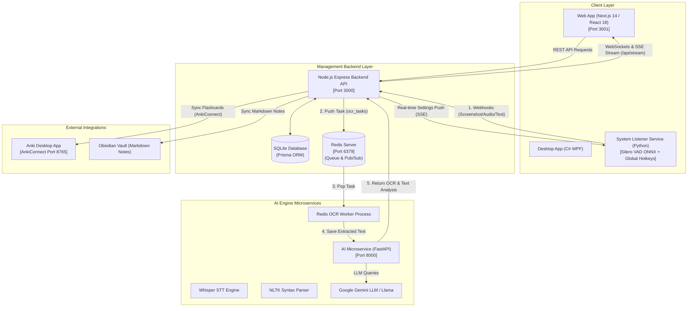
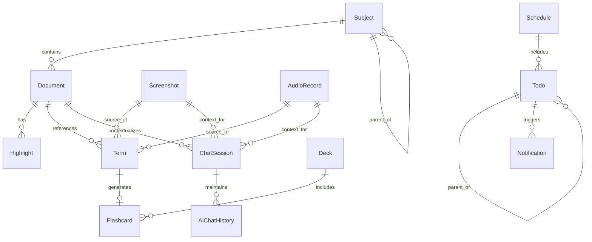

# Kiến Trúc Hệ Thống LingoAnki (System Architecture)

Tài liệu này chi tiết hóa kiến trúc hệ thống, các thành phần microservice, luồng dữ liệu thời gian thực (Real-time Event Pipelines), và mô hình cơ sở dữ liệu của ứng dụng **LingoAnki (English Learner)**.

---

## 1. Tổng Quan Kiến Trúc (Architecture Overview)

LingoAnki được thiết kế theo mô hình **Hybrid Microservices Monorepo**. Hệ thống kết hợp giữa dịch vụ xử lý nền trên máy cục bộ (nhận diện phím tắt hệ thống, thu âm thông minh VAD, OCR qua queue) và dịch vụ Cloud LLM (Gemini API) để tối ưu hóa hiệu năng, trải nghiệm người dùng và tiết kiệm tài nguyên phần cứng.

---

## 2. Các Thành Phần Microservice Chi Tiết

### 2.1. System Listener Service (`services/system-listener/`)
* **Chức năng:** Chạy ứng dụng ẩn nền trên hệ điều hành, đăng ký và lắng nghe các phím tắt hệ thống (Global Hotkeys) toàn cục mà không phụ thuộc vào cửa sổ ứng dụng đang active.
* **Công nghệ:** Python, `pynput`, `onnxruntime`, `requests`.
* **Chi tiết tính năng:**
  * **Global Hotkeys:**
    * `Win + Shift + S`: Kích hoạt công cụ chụp màn hình Snipping Tool -> Nhận file ảnh PNG -> Gửi Webhook `/input/screen` về Backend.
    * `Ctrl + Shift + A`: Kích hoạt micro thu âm giọng nói (luyện Shadowing / Speaking) -> Tự động cắt khi dừng nói nhờ mô hình **Silero VAD (Voice Activity Detection)** -> Gửi Webhook `/input/sound` về Backend.
    * `Ctrl + Q`: Lấy văn bản từ clipboard/bôi đen -> Gửi Webhook `/input/text` về Backend.
  * **Smart Silero VAD (Voice Activity Detection):** Sử dụng model ONNX `silero_vad.onnx` chạy trên ONNXRuntime (hỗ trợ GPU/CPU) để tự động phát hiện khoảng lặng (silence duration) và ngắt thu âm một cách tự nhiên.
  * **Lắng nghe Cấu hình Thời gian thực (SSE Listener):** Mở kết nối Server-Sent Events duy trì tới Backend (`/api/stream`). Khi nhận sự kiện `SETTINGS_UPDATED`, Listener lập tức cập nhật danh sách phím tắt và ngưỡng VAD ngay lập tức tại thời điểm runtime mà không cần khởi động lại.

---

### 2.2. Management Backend API (`backend/`)
* **Chức năng:** Đóng vai trò làm bộ não trung tâm (Control Plane), xử lý các Webhook đầu vào, lưu trữ cơ sở dữ liệu, quản lý phiên chat AI, điều phối thông báo nhắc nhở, đồng bộ thẻ Anki và phát tín hiệu Realtime cho Web UI.
* **Công nghệ:** Node.js, Express, TypeScript, Prisma ORM, SQLite, Redis (`ioredis`), `ws` (WebSockets), Server-Sent Events (SSE), `node-cron`, `zod`.
* **Cấu trúc Feature-based:**
  * `/input`: Tiếp nhận file ảnh screenshot, file ghi âm sound, văn bản text từ System Listener. Đẩy task OCR vào Redis Queue (`ocr_tasks`).
  * `/media`: Quản lý lưu trữ file đa phương tiện (tải lên và phục vụ tĩnh từ thư mục `uploads/`).
  * `/api/documents`: Quản lý danh mục tài liệu (PDF, Sách, Paper), tiến độ đọc (bookmarks/page numbers), các đoạn highlight và ghi chú.
  * `/api/terms`: Quản lý thuật ngữ & từ vựng (Vocabulary/Concepts), lưu ngữ cảnh gốc (Context Sentence), lời giải thích AI, trạng thái đồng bộ Anki/Obsidian.
  * `/api/chat/sessions`: Quản lý cuộc hội thoại chat với AI Copilot trong ngữ cảnh của tài liệu, ảnh chụp hoặc âm thanh đang chọn.
  * `/api/flashcards`: Quản lý thẻ ghi nhớ Spaced Repetition (thuật toán SM-2: interval, repetition, easeFactor, nextReviewDate) và map với note ID trên Anki Desktop.
  * `/anki`: Tích hợp với **AnkiConnect API** (REST `http://127.0.0.1:8765`) để tự động tạo thẻ, kiểm tra từ trùng lặp trong bộ bài (Deck), và cập nhật danh sách thẻ cần học.
  * `/api/schedules` & `/api/todos`: Quản lý lịch học tập, nhiệm vụ cần làm (hỗ trợ todo cha/con) và gửi thông báo nhắc nhở qua `node-cron`.
  * `/api/settings`: Quản lý cấu hình tích hợp (Deck Anki mặc định, đường dẫn Obsidian Vault, phím tắt hệ thống, tham số VAD).

---

### 2.3. AI Microservice (`services/ai/`)
* **Chức năng:** Cung cấp các endpoint microservice chuyên biệt cho xử lý trí tuệ nhân tạo nặng: OCR ảnh, Whisper nhận diện giọng nói, phân tích cấu trúc cú pháp NLTK, và kết nối LLM.
* **Công nghệ:** Python, FastAPI, Uvicorn, Asyncio, PyTorch, OpenAI Whisper, NLTK, Redis Worker.
* **Chi tiết tính năng:**
  * **Redis OCR Worker (`redis_ocr_worker`):** Chạy nhiệm vụ nền lắng nghe danh sách `ocr_tasks` trong Redis, nhận dữ liệu ảnh Base64 từ Backend, thực hiện trích xuất chữ OCR và cập nhật kết quả `extractedText` vào cơ sở dữ liệu SQLite qua Backend API.
  * **Whisper Transcribe Service:** Tiếp nhận file âm thanh WAV (hoặc các chunk âm thanh), chạy mô hình Whisper để nhận diện văn bản chính xác và tính điểm số độ chính xác phát âm (Accuracy Score).
  * **NLTK Grammar Parser:** Bẻ gãy các câu tiếng Anh phức tạp thành các thành phần ngữ pháp chính (Subject, Verb, Object, Clauses) giúp người dùng dễ dàng hiểu cấu trúc bài đọc.

---

### 2.4. Frontend Web App (`frontend/web/`)
* **Chức năng:** Giao diện điều khiển chính cho người dùng trên trình duyệt.
* **Công nghệ:** Next.js 14 (App Router), React 18, Tailwind CSS, Zustand, Lucide React, `react-markdown`, `@hello-pangea/dnd`, `react-big-calendar`.
* **Cấu trúc 3 Cột (Three-Pane Layout):**
  * **Left Sidebar:** Navigation, Thư mục môn học (Subject Hierarchy Tree), Danh mục tài liệu.
  * **Main Content Area:** Trình xem tài liệu (PDF/Markdown Viewer), Dashboard nhiệm vụ học tập & thống kê Anki, Danh sách từ vựng, Lịch biểu (Calendar view).
  * **Right Copilot Panel:** Khung chat AI Copilot trong ngữ cảnh bài đọc, bảng gợi ý từ vựng thông minh, giao diện thu âm Shadowing sóng âm, xem trước thẻ Anki.

---

## 3. Mô Hình Cơ Sở Dữ Liệu (Prisma Database Schema)

Cơ sở dữ liệu SQLite được quản lý thông qua Prisma ORM bao gồm các bảng dữ liệu được liên kết chặt chẽ:

### Các Entity Chính:
1. **`Subject`**: Thư mục môn học (hỗ trợ phân cấp cha-con `parentId`).
2. **`Document`**: Tài liệu PDF, EPUB, URL, bài báo (lưu tên, tác giả, tag, tiến độ đọc `readingProgress`, trạng thái `UNREAD/READING/COMPLETED`).
3. **`Highlight`**: Đoạn bôi đen trong tài liệu, kèm bản dịch/diễn giải AI (`aiParaphrase`, `aiSummary`).
4. **`Term`**: Thuật ngữ/Từ vựng lưu lại (chứa `term`, `contextSentence`, `aiExplanation`, trạng thái đồng bộ `ankiSyncStatus`, `obsidianSyncStatus`).
5. **`Flashcard`**: Thẻ ghi nhớ SRS (thông số thuật toán SM-2: `interval`, `repetition`, `easeFactor`, `nextReviewDate`, liên kết `externalNoteId` AnkiConnect).
6. **`ChatSession` & `AiChatHistory`**: Phiên làm việc và lịch sử tin nhắn với AI Copilot.
7. **`Screenshot` & `AudioRecord`**: Dữ liệu chụp màn hình và ghi âm giọng nói từ System Listener.
8. **`Schedule` & `Todo`**: Lịch biểu và công việc cần làm.
9. **`IntegrationSetting`**: Lưu trữ toàn bộ thông số cấu hình hệ thống (Anki deck name, hotkeys, VAD threshold, vault path).

---

## 4. Các Luồng Dữ Liệu Thực Tế (Data Flow Sequences)

### Flow 1: Trích xuất Từ vựng qua Chụp Màn Hình (Global Screenshot OCR)
1. Người dùng bấm phím tắt **`Win + Shift + S`** ở bất kỳ đâu trên Windows.
2. `SystemListener` chụp vùng màn hình -> lưu file tạm -> gửi HTTP POST Webhook lên Backend `/input/screen`.
3. Backend tạo bản ghi `Screenshot` trong DB -> đẩy task `{ task_id, image_base64 }` vào Redis Queue `ocr_tasks`.
4. `RedisOCRWorker` trong AI Service nhận task -> chạy OCR trích xuất chữ -> cập nhật `extractedText` vào SQLite DB.
5. Backend phát thông điệp WebSockets & SSE `screen_result` tới Web App -> Khung AI Copilot hiển thị chữ được trích xuất để người dùng chọn tra từ hoặc phân tích.

### Flow 2: Luyện Nhận Diện Giọng Nói & Shadowing (VAD Audio Recording)
1. Người dùng bấm **`Ctrl + Shift + A`** và đọc câu tiếng Anh.
2. `SystemListener` ghi âm luồng audio -> `Silero VAD` liên tục phân tích tín hiệu âm thanh -> Tự động nhận diện khi người dùng ngừng nói quá 1.2 giây -> Ngắt thu âm.
3. Listener gọi AI Service Whisper API để lấy chuỗi nhận diện chữ -> Đẩy file `.wav` + chuỗi text về Backend Webhook `/input/sound`.
4. Backend lưu `AudioRecord` -> Broadcast kết quả phát âm tới Web App qua SSE/WebSocket để hiển thị điểm độ chính xác (Accuracy Score).

### Flow 3: Đồng Bộ Cấu Hình Phím Tắt Hệ Thống Thời Gian Thực (Dynamic Settings Sync)
1. Người dùng thay đổi phím tắt hoặc ngưỡng ngắt giọng nói VAD trên trang Web Settings.
2. Web UI gọi REST API `PUT /api/settings`.
3. Backend cập nhật bảng `IntegrationSetting` trong SQLite -> Gọi `broadcastSSE('SETTINGS_UPDATED', newConfig)`.
4. Thread SSE Listener trong `SystemListener` nhận được JSON event `SETTINGS_UPDATED` -> Gọi `listener.update_config()` để cập nhật Hotkeys và Silero VAD parameters ngay lập tức mà không cần khởi động lại dịch vụ.
